# NostrPass Message Flow Documentation

## Overview

This document details the complete message flow between components in NostrPass, including initialization, authentication, and all NIP-07 operations.

## Component Communication Architecture

```
┌──────────────┐     postMessage      ┌──────────────┐     Worker API    ┌──────────────┐
│   Embassy    │ ◄─────────────────► │    Vault     │ ◄───────────────► │Crypto Worker │
│   (Parent)   │    Cross-Origin      │   (Iframe)   │    Same-Origin    │  (Worker)    │
└──────────────┘                      └──────────────┘                    └──────────────┘
      ▲                                      ▲
      │                                      │
      └──────────────────┬───────────────────┘
                         │
                   IndexedDB / Nostr
```

## 1. Initialization Flow

### 1.1 Embassy Initialization

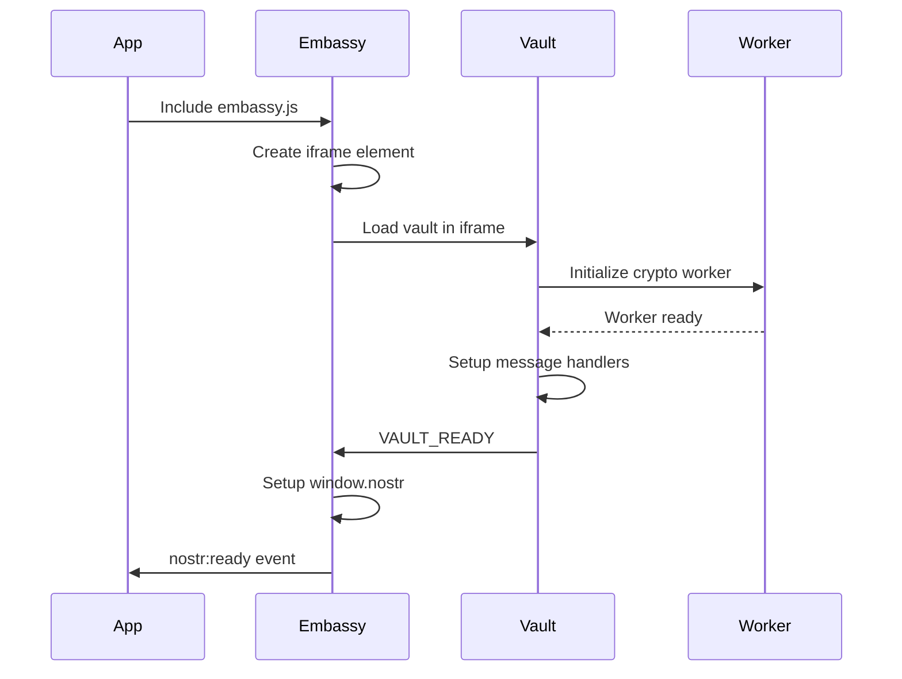

**Detailed Steps:**

1. **App includes Embassy SDK**
```javascript
// In app HTML
<script src="https://nostrpass.com/embassy.js"></script>
```

2. **Embassy creates iframe**
```javascript
// embassy.ts
const iframe = document.createElement('iframe');
iframe.src = `${VAULT_URL}?${params}`;
iframe.style.display = 'none';
document.body.appendChild(iframe);
```

3. **Vault sends ready signal**
```javascript
// Vault MessengerProvider.tsx
messenger.send('VAULT_READY', {
  timestamp: Date.now(),
  version: '1.0.0'
});
```

4. **Embassy completes setup**
```javascript
// Creates window.nostr object
window.nostr = {
  getPublicKey: () => embassy.getPublicKey(),
  signEvent: (event) => embassy.signEvent(event),
  // ... other methods
};
```

## 2. Authentication Flows

### 2.1 New User Registration

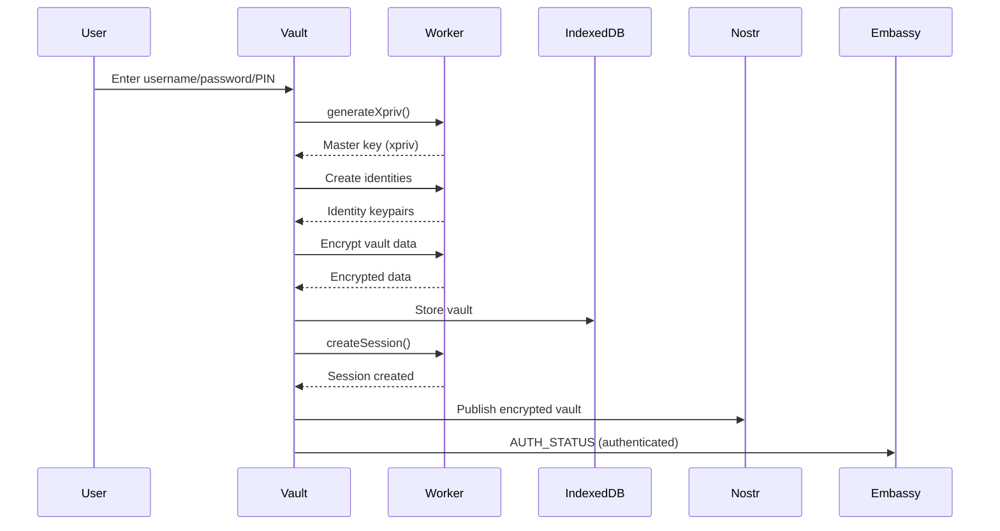

**Message Details:**

1. **Generate master key**
```javascript
// Worker message
{
  type: 'generateXpriv',
  data: {}
}
// Response
{
  xpriv: "xprv...",
  xpub: "xpub..."
}
```

2. **Create session**
```javascript
// Worker message
{
  type: 'createSession',
  data: {
    username: "alice",
    vaultData: { ... },
    privateKey: "hex_private_key"
  }
}
```

### 2.2 User Login

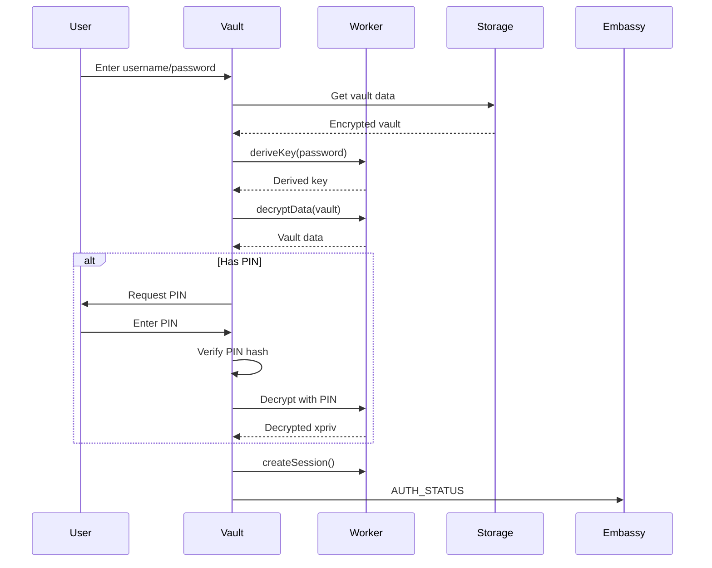

## 3. NIP-07 Operation Flows

### 3.1 Get Public Key

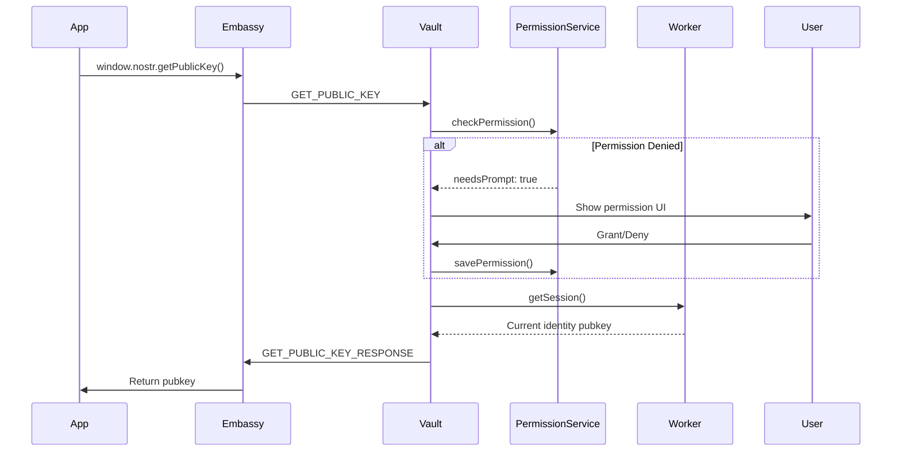

**Messages:**

```javascript
// Request
{
  id: "msg_123",
  type: "GET_PUBLIC_KEY",
  data: {
    appName: "MyApp",
    appDomain: "https://myapp.com"
  },
  timestamp: 1234567890,
  origin: "https://myapp.com"
}

// Response
{
  id: "msg_123",
  type: "GET_PUBLIC_KEY_RESPONSE",
  data: "d1d1747115d16751a97c239f46ec1703292c3b7e24e21e0e03b5b069fe58c7f9",
  timestamp: 1234567891,
  origin: "https://vault.nostrpass.com"
}
```

### 3.2 Sign Event

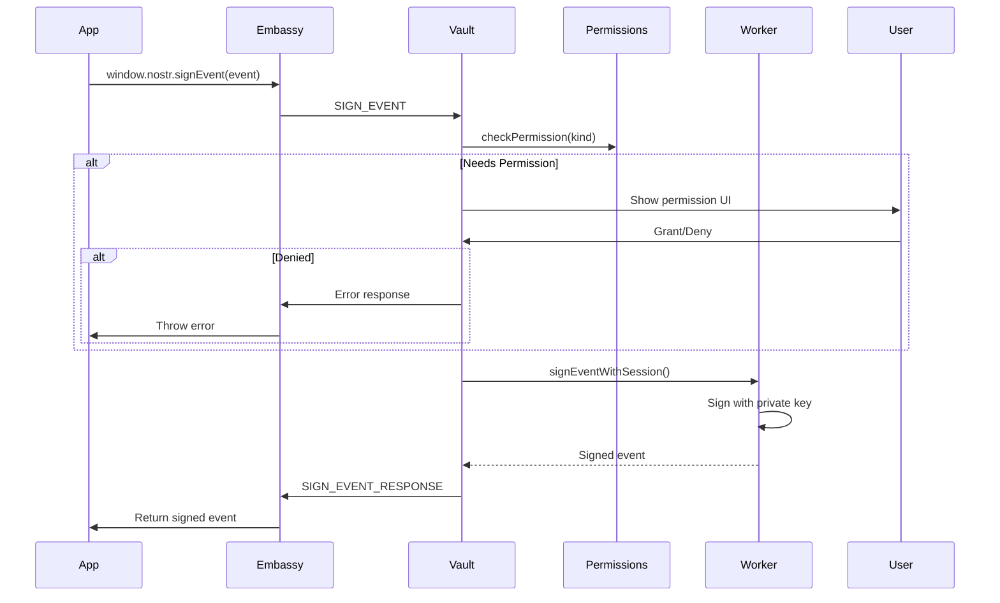

**Messages:**

```javascript
// Request
{
  id: "msg_456",
  type: "SIGN_EVENT",
  data: {
    event: {
      kind: 1,
      created_at: 1234567890,
      tags: [],
      content: "Hello Nostr!"
    },
    appName: "MyApp",
    appDomain: "https://myapp.com"
  }
}

// Response
{
  id: "msg_456",
  type: "SIGN_EVENT_RESPONSE",
  data: {
    id: "event_id_hash",
    pubkey: "public_key_hex",
    created_at: 1234567890,
    kind: 1,
    tags: [],
    content: "Hello Nostr!",
    sig: "signature_hex"
  }
}
```

### 3.3 Encrypt (NIP-04)

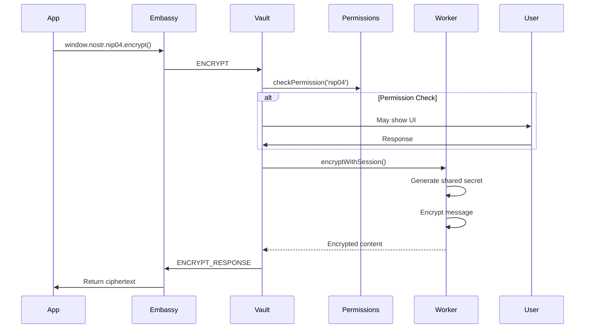

## 4. Permission System Flow

### 4.1 Permission Check Flow

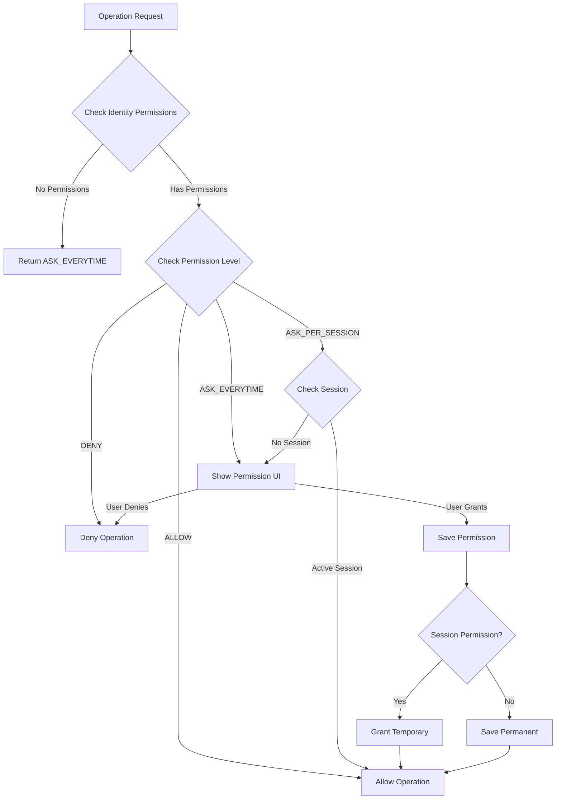

### 4.2 Permission Storage Update

```javascript
// Permission structure per identity
{
  "https://app.com": {
    appId: "https://app.com",
    appName: "Example App",
    grantedAt: 1234567890,
    lastUsedAt: 1234567890,
    kinds: {
      1: "ALLOW",        // Text notes
      7: "ASK_PER_SESSION",  // Reactions
      30023: "DENY"      // Long-form content
    },
    signData: "ASK_EVERYTIME",
    getPublicKey: "ALLOW",
    nip04: "ASK_PER_SESSION"
  }
}
```

## 5. Worker Communication

### 5.1 Worker Message Pattern

All worker operations follow this pattern:

```javascript
// Main thread -> Worker
postMessage({
  type: 'operationName',
  data: { /* operation data */ }
});

// Worker -> Main thread
postMessage({
  success: true,
  data: { /* result data */ }
});
// OR
postMessage({
  success: false,
  error: "Error message"
});
```

### 5.2 Session-Based Operations

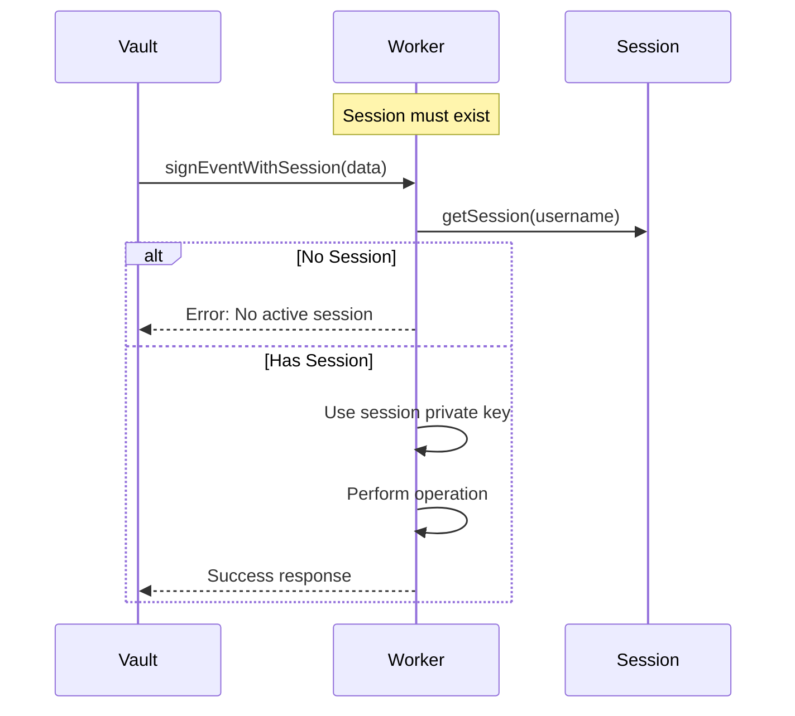

## 6. Error Handling Flow

### 6.1 Error Propagation

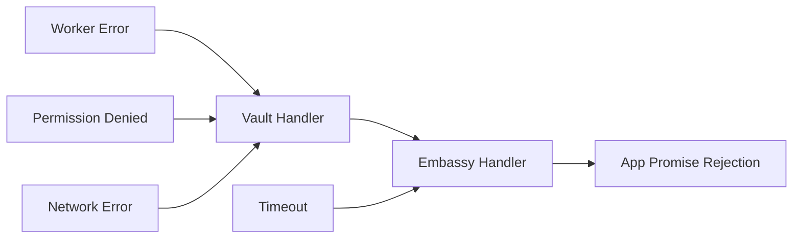

### 6.2 Error Message Format

```javascript
// Error response
{
  id: "msg_789",
  type: "OPERATION_RESPONSE",
  data: {
    error: "User denied permission"
  },
  timestamp: 1234567890,
  origin: "https://vault.nostrpass.com"
}
```

## 7. Special Flows

### 7.1 Vault Visibility Control

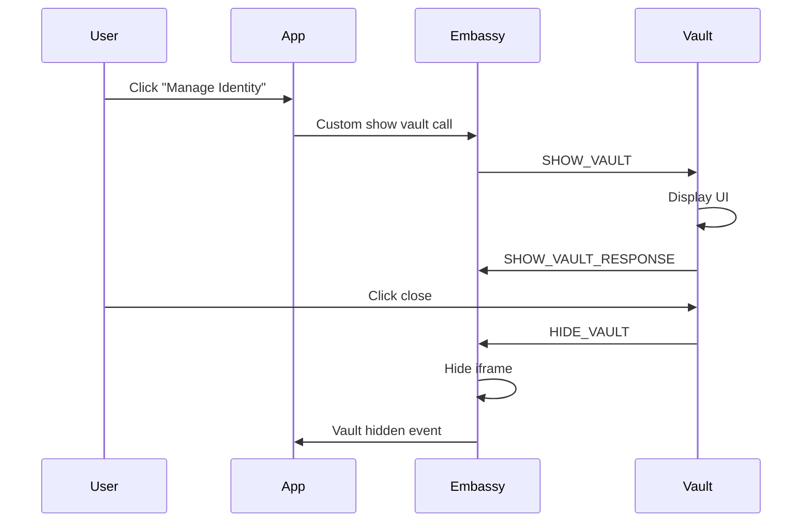

### 7.2 Authentication State Sync

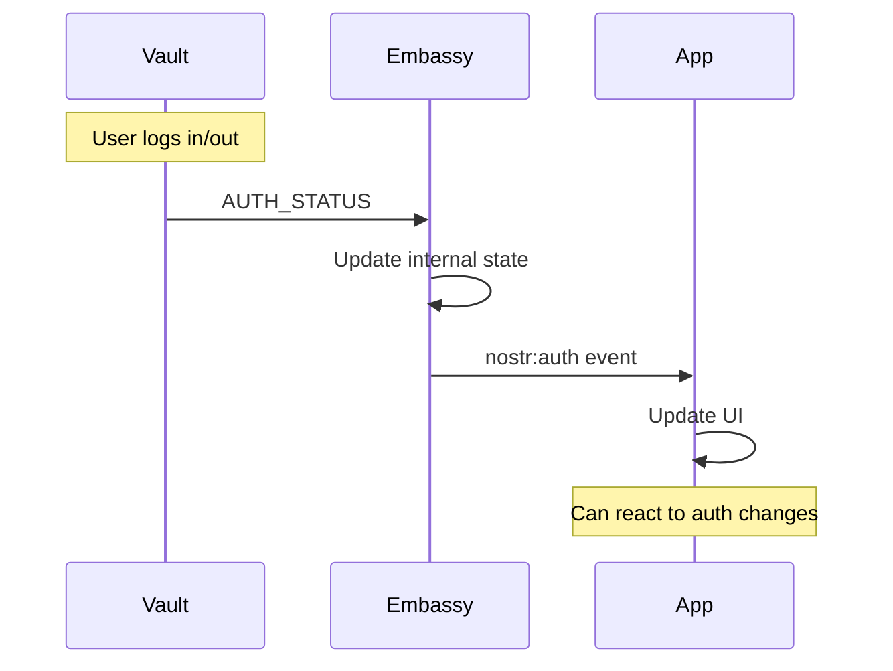

## 8. Timeout and Retry Mechanisms

### 8.1 Request Timeout

```javascript
// Embassy timeout handling
const timeout = setTimeout(() => {
  pendingRequests.delete(messageId);
  reject(new Error('Request timeout'));
}, 30000); // 30 second default

// Clear on response
clearTimeout(timeout);
```

### 8.2 Retry Logic

```javascript
// App-level retry
async function retryOperation(operation, maxRetries = 3) {
  for (let i = 0; i < maxRetries; i++) {
    try {
      return await operation();
    } catch (error) {
      if (i === maxRetries - 1) throw error;
      await wait(1000 * Math.pow(2, i)); // Exponential backoff
    }
  }
}
```

## 9. Performance Optimizations

### 9.1 Message Batching

Multiple operations can be batched:

```javascript
// Instead of multiple calls
await nostr.getPublicKey();
await nostr.signEvent(event1);
await nostr.signEvent(event2);

// Batch operation (future enhancement)
await nostr.batch([
  { method: 'getPublicKey' },
  { method: 'signEvent', params: [event1] },
  { method: 'signEvent', params: [event2] }
]);
```

### 9.2 Caching Strategies

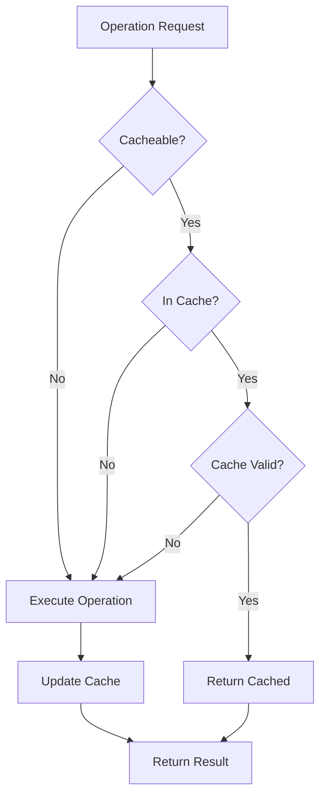

## Summary

The message flow in NostrPass is designed to be:

1. **Secure**: All messages validate origin and use typed contracts
2. **Async**: All operations are promise-based with proper error handling
3. **Stateless**: Each message is self-contained with all needed context
4. **Traceable**: Unique IDs allow tracking request/response pairs
5. **Extensible**: New operations can be added without breaking existing flows

This architecture ensures reliable, secure communication between all components while maintaining clear separation of concerns.