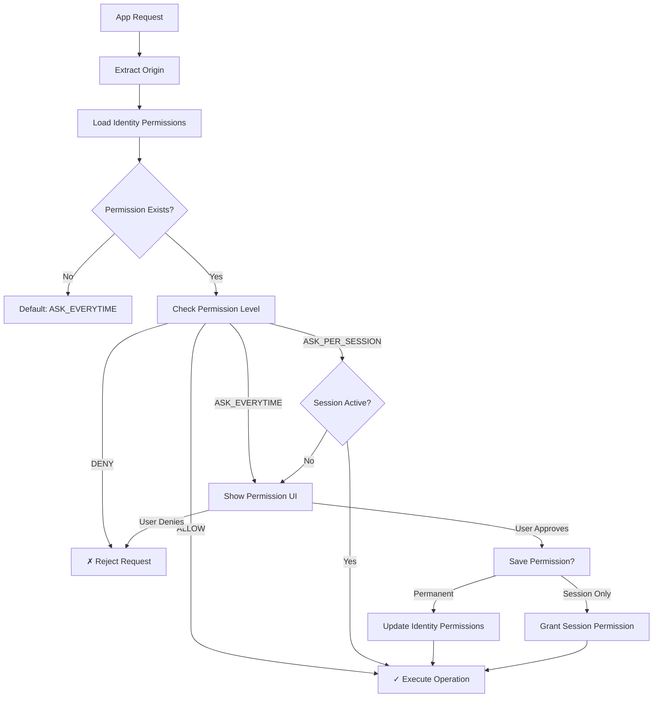
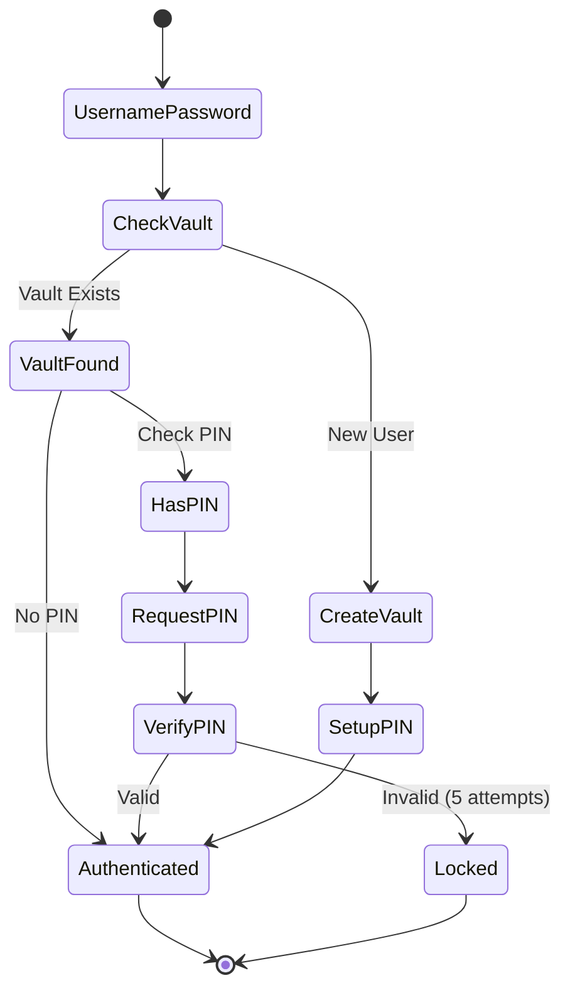
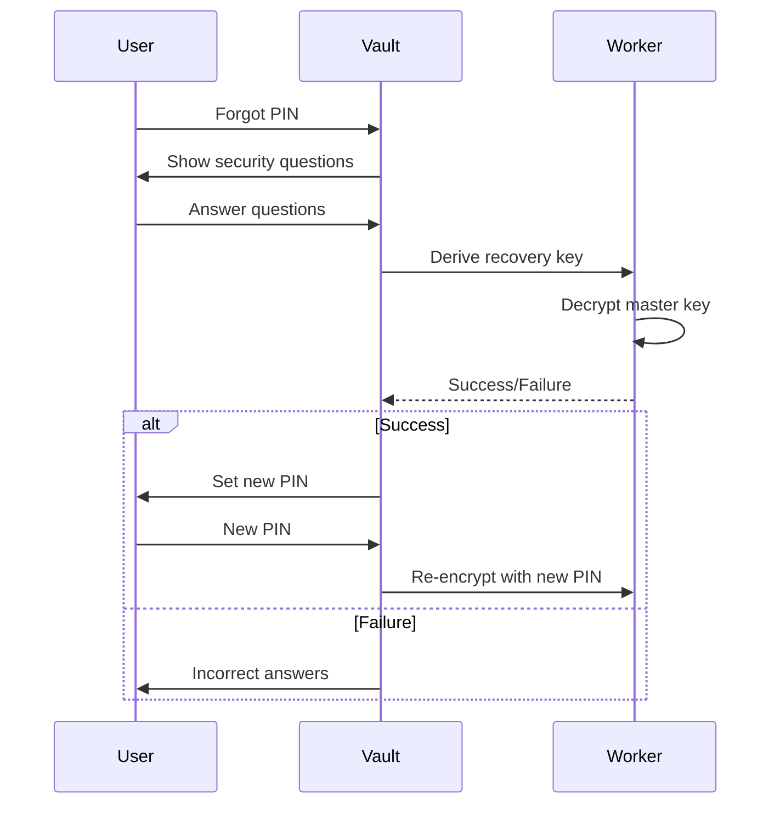

# NostrPass Security and Permissions Documentation

## Security Overview

NostrPass implements defense-in-depth security with multiple layers of protection:

1. **Isolation**: Components run in separate contexts (iframe, worker, WASM)
2. **Encryption**: All sensitive data encrypted at rest and in transit
3. **Authentication**: Multi-factor with password + optional PIN
4. **Authorization**: Granular permission system per app and identity
5. **Validation**: Origin checking and message verification

## Security Architecture

```
┌─────────────────────────────────────────────────────────────┐
│                     Security Layers                         │
├─────────────────────────────────────────────────────────────┤
│  1. Origin Validation (Cross-Origin Security)               │
│     - Whitelist allowed origins                             │
│     - Validate every message                                │
│     - Reject unauthorized sources                           │
├─────────────────────────────────────────────────────────────┤
│  2. Iframe Sandbox (Process Isolation)                      │
│     - Restricted permissions                                │
│     - No access to parent DOM                               │
│     - Controlled communication only                         │
├─────────────────────────────────────────────────────────────┤
│  3. Worker Context (Thread Isolation)                       │
│     - Private keys never leave worker                       │
│     - Session-based access model                            │
│     - Automatic session expiry                              │
├─────────────────────────────────────────────────────────────┤
│  4. Encryption Layer (Data Protection)                      │
│     - AES-256-GCM for vault data                           │
│     - Argon2 key derivation                                │
│     - NIP-04 for Nostr messages                            │
├─────────────────────────────────────────────────────────────┤
│  5. Permission System (Access Control)                      │
│     - Per-identity permissions                              │
│     - Granular operation control                            │
│     - User consent required                                 │
└─────────────────────────────────────────────────────────────┘
```

## Cryptographic Security

### 1. Key Hierarchy

```
User Password
     │
     ├─── Argon2 ──► Encryption Key
     │                    │
     │                    └──► Encrypt Master Key (xpriv)
     │
     └─── SHA-256 ──► Password Verifier

User PIN (optional)
     │
     ├─── Argon2 ──► PIN Encryption Key
     │                    │
     │                    └──► Encrypt Master Key (xpriv)
     │
     └─── SHA-256 ──► PIN Hash (for verification)

Master Key (xpriv)
     │
     └─── BIP32 Derivation
              │
              ├──► Identity 0 (Personal)
              ├──► Identity 1 (Work)
              ├──► Identity N (Custom)
              └──► Identity 2^31-1 (Storage)
```

### 2. Encryption Specifications

**Vault Data Encryption:**
- Algorithm: AES-256-GCM
- Key Derivation: Argon2id
  - Memory: 64MB
  - Iterations: 3
  - Parallelism: 4
  - Salt: 32 bytes (random)

**NIP-04 Message Encryption:**
- Algorithm: AES-256-CBC
- Key Agreement: ECDH (secp256k1)
- IV: 16 bytes (random)
- Format: `base64(encrypted)?iv=hex(iv)`

**PIN Encryption:**
- Algorithm: AES-256-GCM
- Key Derivation: Argon2id (separate salt)
- Additional: PIN hash stored for verification

### 3. Key Storage Security

```javascript
// Keys are NEVER stored in plaintext
// Storage hierarchy:

// 1. Master key (xpriv) - Encrypted with PIN or password
{
  encryptedXpriv: "encrypted_base64_data",
  salt: "hex_salt_for_password",
  pinSalt: "hex_salt_for_pin"
}

// 2. Session private key - Only in worker memory
// Never serialized or sent to main thread

// 3. Storage keys - Derived on demand
// Used for vault operations only
```

## Permission System

### 1. Permission Model

```typescript
type PermissionLevel = 
  | 'ALLOW'           // Always allow
  | 'ASK_PER_SESSION' // Ask once per session
  | 'ASK_EVERYTIME'   // Ask every time
  | 'DENY';           // Always deny

interface AppPermissions {
  // Operation permissions
  kinds: Record<number, PermissionLevel>;  // Per event kind
  signData: PermissionLevel;               // Arbitrary signing
  getPublicKey?: PermissionLevel;          // Pubkey access
  nip04?: PermissionLevel;                 // Encryption
  getRelays?: PermissionLevel;             // Relay access
  
  // Session state
  sessionPermissions?: {
    kinds: Record<number, boolean>;
    signData: boolean;
    expiresAt: number;
  };
}
```

### 2. Permission Flow



### 3. Permission Inheritance

```
App Domain: https://app.example.com
                    │
                    ▼
        Check Current Identity
                    │
    ┌───────────────┴───────────────┐
    │                               │
    ▼                               ▼
Identity Has                   No Identity
Permissions                    Permissions
    │                               │
    ▼                               ▼
Use Identity                   Check Legacy
Permissions                    Vault Permissions
                                   │
                                   ▼
                              Use Default
                              (ASK_EVERYTIME)
```

### 4. Default Permissions

When user signs up through an app:

```javascript
{
  kinds: { 
    1: 'ALLOW'  // Text notes auto-granted
  },
  signData: 'DENY',
  getPublicKey: 'ALLOW',  // Auto-granted for signup app
  nip04: 'ASK_EVERYTIME',
  getRelays: 'ASK_EVERYTIME'
}
```

## Authentication Security

### 1. Multi-Factor Authentication



### 2. Session Management

**Session Properties:**
- Stored only in worker memory
- Automatic expiration (1 hour default)
- Cleared on logout or page refresh
- Contains decrypted private key

**Session Security:**
```javascript
// Session structure (in worker only)
{
  username: string,
  privateKey: string,      // Never leaves worker
  publicKey: string,
  identityIndex: number,
  expiresAt: number,
  createdAt: number
}
```

### 3. PIN Security

**PIN Requirements:**
- Minimum 4 digits
- Maximum 8 digits
- Numbers only
- Different from username

**PIN Protection:**
- 5 attempt limit
- 5 minute lockout after max attempts
- Separate salt from password
- Hash stored for verification

## Origin Security

### 1. Origin Validation

```javascript
// Every message validated
function validateOrigin(event: MessageEvent): boolean {
  const allowedOrigins = [
    'https://app.example.com',
    'https://trusted-app.com'
  ];
  
  return allowedOrigins.includes(event.origin);
}
```

### 2. Development vs Production

**Development:**
```javascript
// Localhost allowed for testing
const devOrigins = [
  'http://localhost:3000',
  'http://localhost:3001',
  'http://127.0.0.1:3000'
];
```

**Production:**
```javascript
// Strict origin checking
const prodOrigins = [
  'https://nostrpass.com',
  'https://app.nostrpass.com'
];
```

## Data Security

### 1. Storage Security

**IndexedDB:**
- Encrypted before storage
- No plaintext sensitive data
- Automatic cleanup on logout

**Nostr Network:**
- Vault encrypted before publishing
- Kind 30078 (replaceable)
- Signed with storage identity

### 2. Memory Security

**Sensitive Data Handling:**
```javascript
// Good: Data stays in worker
worker.postMessage({ type: 'sign', data: eventData });

// Bad: Private key in main thread
const privateKey = getPrivateKey(); // Never do this!
```

**Automatic Cleanup:**
- Sessions expire after timeout
- Memory cleared on logout
- No persistent decrypted data

## Attack Mitigation

### 1. Common Attack Vectors

**Cross-Site Scripting (XSS):**
- Content Security Policy enforced
- No inline scripts
- Input sanitization

**Clickjacking:**
- X-Frame-Options header
- Frame ancestors restricted
- UI overlay detection

**Message Injection:**
- Origin validation
- Message structure verification
- Timestamp validation (5 min window)

### 2. Defense Mechanisms

```javascript
// Message validation
function isValidMessage(message: any): boolean {
  return (
    message &&
    typeof message.id === 'string' &&
    typeof message.type === 'string' &&
    typeof message.timestamp === 'number' &&
    typeof message.origin === 'string' &&
    // Timestamp within 5 minutes
    Math.abs(Date.now() - message.timestamp) < 300000
  );
}
```

## Security Best Practices

### 1. For Developers

**Integration Security:**
```javascript
// Good: Check authentication state
try {
  const pubkey = await window.nostr.getPublicKey();
  // User is authenticated
} catch (error) {
  // Handle unauthenticated state
}

// Good: Handle permission denials
try {
  const signed = await window.nostr.signEvent(event);
} catch (error) {
  if (error.message === 'User denied permission') {
    // Show explanation to user
  }
}
```

**Origin Configuration:**
```javascript
// Always specify exact origins in production
const embassy = new Embassy({
  vaultUrl: 'https://vault.nostrpass.com',
  allowedOrigins: ['https://myapp.com']
});
```

### 2. For Users

**Account Security:**
1. Use strong, unique password
2. Enable PIN for additional security
3. Set up recovery questions
4. Review app permissions regularly

**Permission Management:**
1. Only grant necessary permissions
2. Use session permissions for temporary access
3. Revoke unused app permissions
4. Check permission requests carefully

## Recovery Mechanisms

### 1. PIN Recovery

```javascript
// Recovery setup
{
  questions: [
    {
      id: "q1",
      question: "Your first pet's name?",
      answerHash: "sha256_hash"
    },
    // ... more questions
  ],
  encryptedMasterKey: "encrypted_with_recovery_key",
  salt: "recovery_salt"
}
```

### 2. Recovery Flow



## Audit Trail

### 1. Permission Events

```javascript
// Logged permission events
{
  timestamp: Date.now(),
  action: 'PERMISSION_GRANTED',
  identity: 'Personal',
  app: 'https://app.example.com',
  permission: 'kinds[1]',
  level: 'ALLOW'
}
```

### 2. Security Events

- Failed login attempts
- PIN lockouts
- Permission changes
- Recovery attempts
- Session creation/expiry

## Compliance

### 1. Data Privacy

- No tracking or analytics
- Data encrypted before storage
- User controls all data
- Right to delete (logout removes local data)

### 2. Security Standards

- OWASP security guidelines
- Cryptographic best practices
- Regular security updates
- Open source for transparency

## Future Security Enhancements

### 1. Planned Features

**Hardware Security:**
- WebAuthn support
- Hardware wallet integration
- Biometric authentication

**Advanced Permissions:**
- Time-based restrictions
- Amount limits for financial operations
- Geolocation restrictions
- Device-specific permissions

**Enhanced Recovery:**
- Social recovery (M-of-N)
- Threshold signatures
- Dead man's switch

### 2. Continuous Improvement

- Regular security audits
- Penetration testing
- Bug bounty program
- Community security reviews

This comprehensive security model ensures NostrPass provides a secure, user-controlled identity management system while maintaining usability and flexibility.